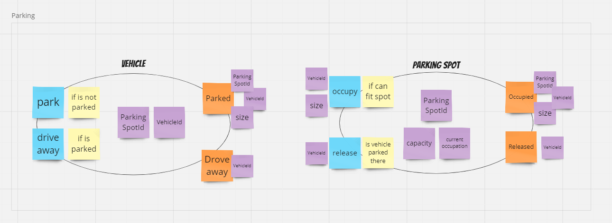
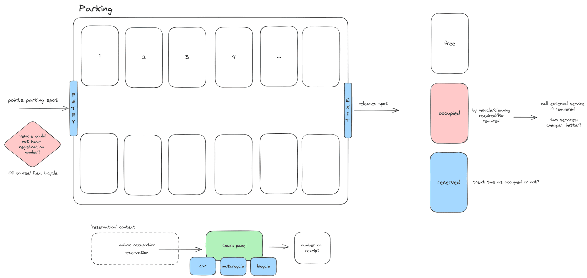

# Parking Domain - [contest 100 commits](https://100commitow.pl/)

> Choosing to learn about the domain before implementing is the optimal decision you can make.

The Parking Domain project aims to demonstrate the evolution from a rudimentary and limited model to a more
sophisticated solution.
I'm committed to undertaking this challenge and seeing if I can successfully navigate it. 😎

This is just experiment which serves solely for **educational purposes**. While I will define the MVP and other
necessary aspects,
it's important to note that this domain is not the ultimate goal itself.

**Let jump into the code and see what will happen!**

## Used frameworks/libraries/tools

Main:

- [Java 21](https://openjdk.org/projects/jdk/21/)
- [Maven](https://maven.apache.org/)
- [Spring Boot 3](https://spring.io/projects/spring-boot)
    - [Web](https://docs.spring.io/spring-boot/docs/current/reference/html/web.html)
    - [JPA](https://spring.io/projects/spring-data-jpa)
- [Lombok](https://projectlombok.org/)

Tests:

- [H2 database](https://www.h2database.com/html/main.html)
- [vavr](https://docs.vavr.io/)
- [Awaitility](http://www.awaitility.org/)

Tools:

- [Bruno](https://www.usebruno.com/)

## Lessons learnt

1. _Ideal code does not exist!_
1. _Make analysis before coding!_
1. _Tests are great, but when you are prototyping they are slowing you down_

## FAQ

### Is it production-ready?

Nope. At this stage, it's purely conceptual. We'll see where this experiment takes us. Undoubtedly, there's much to
learn along the way, for both of us!

### Why parking domain?

Don't know. I experimented with implementing the voting and vaccination domains, deliberately writing ugly code for
educational purposes. However, the outcome left me feeling discouraged. I've shared this experience
on [my blog \[PL\]](https://cezarysanecki.pl/2024/02/13/prezentacja-prostej-domeny/). I'm hopeful that coding an anemic
model for the parking domain won't result in the same challenges as my previous attempts. Interestingly, I came across
this domain in one of the [DevMentors YouTube videos](https://www.youtube.com/@DevMentorsPL/videos), and I thought, "Why
not give it a try?"

### Why Java and Spring?

Because it's my "native" background, and my goal isn't to learn a new language. I aim to learn how to model a domain
with existing legacy code and explore tools from the JVM ecosystem (but not exclusively).

## MVP

- [X] 3-layer app with anemic model (without tests)
    - [X] Occupation logic
    - [X] Reservation logic
    - [ ] ~~Fee logic~~
- [X] Refactoring to add unit tests
- [X] Looking for deep model (modules)
    - [X] Do simple Event Storming session
- [ ] Add other types of requirements
    - [ ] Cleaning
    - [ ] Maintenance
    - [ ] Loyalty points
    - [ ] Customer recovery
- [X] Add CQRS
- [ ] ...

## Business context

This software is being developed for a client who owns a parking facility near a shopping center and offices. Presently,
anyone can park there for a small fee. However, this setup is frustrating for both the business and its clients. The
business earns only a modest amount, while clients struggle to find parking due to constant occupation.

The business aims to address this situation by implementing software that enables users to reserve parking spots for
specific times of the day. Additionally, the software will optimize parking utilization by allowing multiple small
vehicles to occupy a single parking spot. Further requirements are outlined below.

### Parking

- Parking is available 24/7
- Parking spots have their own identity
- Parking spots are assigned to groups: BRONZE, SILVER, GOLD (attractiveness spot)
- Parking spots can be occupied (for now) by: cars, motorcycles and scooters
- Every parking spot has its own capacity (for now it is 4 units)
- On parking spot can park different combinations of vehicle types f.ex.
    - One vehicle (1 x 4)
    - Two motorcycles (2 x 2)
    - One motorcycles and two scooters (1 x 2 + 2 x 1)
    - Four scooters (4 x 1)

### Making reservation

- Reservation can only be made only for the next day
- Client can have only one valid reservation
- Client can make reservation for
    - any parking spot
        - from class (BRONZE, SILVER, GOLD)
        - for specified vehicle type
        - last until:
            - vehicle drives away
            - reservation time has expired
    - chosen parking spot
        - whole spot (can park even 4 scooters)
        - last until:
            - all vehicles drive away
            - reservation time has expired
- Making reservation on chosen parking spot is available for additional fee
- Reservations can be made and cancelled at any time, except the period between 4-5am.
- Reservation can be made for
    - morning (7:00-17:00)
    - evening (18:00-24:00)
    - whole day (7:00-24:00)
- Reservation can be extended to whole day
    - if was morning reservation
    - if current spot has no reservation for evening
- Users have the option to extend their reservations by selecting any available parking spot from the same class if
  their current spot is already reserved.
- Reservations become effective for a given day during the reservation window (4-5am)

### Reservation fulfillment

- If a client fails to fulfill a reservation:
    - he will be charged for the reservation
    - his loyalty points will be reduced
- If a client fully completes a reservation, they will earn loyalty points.

### Encourage to free reserved parking spot

> To be changed in future!

- Clients who are on reserved chosen parking spot
    - notify them that they should free parking spot
    - give them discount for current parking

### Cleaning parking spots

> To be changed!

- Because parking is available 24/7, we cannot schedule a technical break to clean the spots
- We need to track when the spots were last cleaned and mark them as "out of order" when a specified period of time has
  passed since the last cleaning
- When 5 spots are marked for cleaning, we request the cleaning service

### Repair/Maintenance of parking spots

> To be changed!

- Almost the same as cleaning parking spots
- It may not be as widespread as cleaning, but occasionally, we may need to change the parking surface
- Clients can report a malfunction or issue with a parking spot
    - They will receive loyalty points
    - If they are given access to the broken spot, they should also be provided access to another parking spot from the
      emergency bank

### Fee

> To be changed!

- Standard usage of parking spot:
    - 15 minutes - free
    - 1 hour - 5PLN
    - 2 hours - 9PLN
    - 4 hours - 17PLN
    - one day - 40PLN
    - each successive day - 50PLN
- Subscription:
    - dedicated spot bank
    - exclusive parking spot
    - monthly - 1000PLN
- Discount:
    - 1-10% for:
        - reporting issues
        - being loyal client (park for more than half of the days in a month)
        - recommendation

### Loyalty points

> To be changed!

- Clients can receive loyalty points for reporting issues or being "long-term" client
- "Long-term" client is someone who park for more than half of the days in a month - 3 months in a row
- Loyalty points can be redeemed to receive gifts

### Customer recovery

> To be changed!

- A customer labeled as 'difficult' has the right to assert their innocence
- If the verifier accepts the justification, a discount should be provided to that person as compensation

## Analysis

### Parking subdomain

## Educational goals

I would like to learn the following technologies/tools. I need to consider which of them to use
in the current project during the MVP phase. Certainly, I will create an anemic model using a 3-layer architecture.

- Very ugly 3-layer app (anemic models)
- Refactoring
    - Unit/Integration tests (Protect business logic) + TestContainers if needed
    - Change logic to add more unit tests
    - Split domains/hexagonal architecture
- Save form vs Save state per field
- Security (OAuth, SSL, CORS etc.)
- Event Sourcing
- Microservices
    - Service discovery
    - Circuit breaker
    - Tenants?
- Functional approach
- Kubernetes/Docker
- Kotlin
- Kafka
- Read Model/CQRS
- Slack notifications
- JOOQ
- Micronaut/Quarkus
- HotWire
- Observability
- Profiling
- Documentation
- Bi-temporal event
- jMeter

## Scratches

## Inspirations

- [DevMentors YouTube video](https://www.youtube.com/@DevMentorsPL/videos)
- [Library by example](https://github.com/ddd-by-examples/library)

