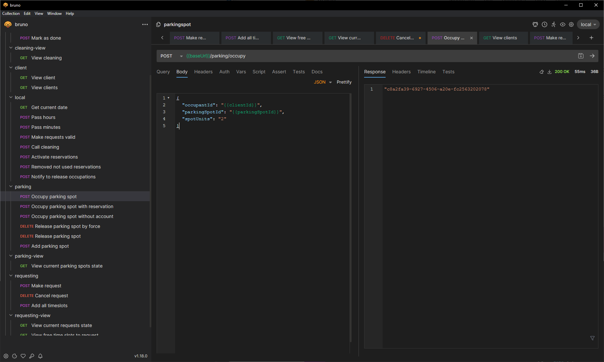
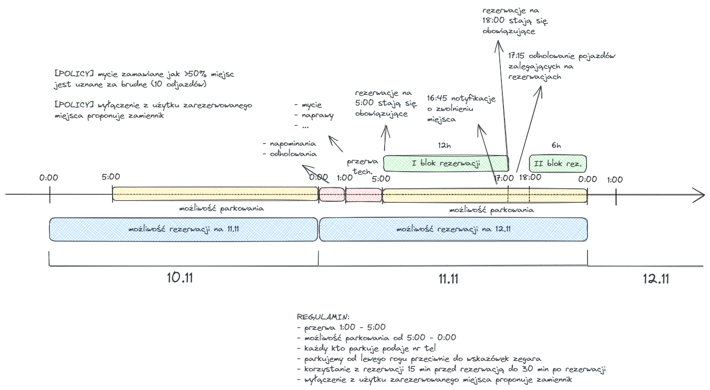
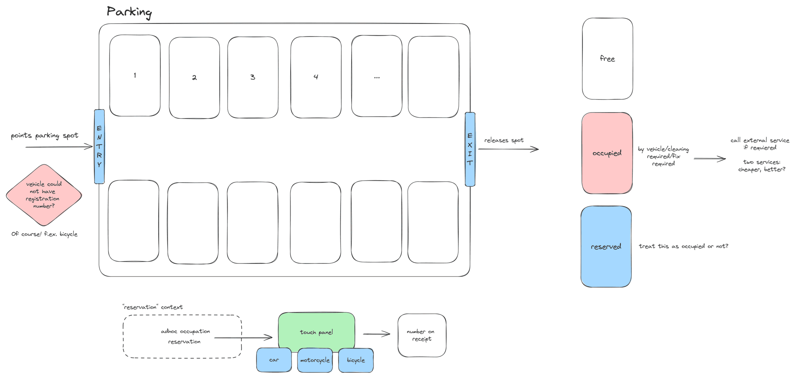

[](https://github.com/cezarysanecki/parking-domain/actions/workflows/maven.yml)
[](https://codecov.io/gh/cezarysanecki/parking-domain)


# Parking Domain - [contest 100 commits](https://100commitow.pl/)

> Studying the business domain before its implementation is the best decision you can make.

The Parking Domain project aims to demonstrate the evolution from a rudimentary and limited model to a more
sophisticated solution. I'm committed to undertaking this challenge and seeing if I can successfully navigate it. 😎

This is just experiment which serves solely for **educational purposes**. While I will define the MVP and other
necessary aspects, it's important to note that this domain is not the ultimate goal itself.

**Let’s dive into the code and see where it takes us!**

## Used frameworks/libraries/tools

Main:

- [Java 21](https://openjdk.org/projects/jdk/21/)
- [Maven](https://maven.apache.org/)
- [Spring Boot 3](https://spring.io/projects/spring-boot)
    - [Web](https://docs.spring.io/spring-boot/docs/current/reference/html/web.html)
- [Quartz](https://www.quartz-scheduler.org/)
- [Lombok](https://projectlombok.org/)
- [JOOQ](https://www.jooq.org/)
- [Postgres](https://www.postgresql.org/)
- [Liquibase](https://www.liquibase.com/)

Tests:

- [Testcontainers](https://testcontainers.com/)
- [Spock](https://spockframework.org/)

Tools:

- [Bruno](https://www.usebruno.com/)

## Lessons learnt

👉 _Ideal code does not exist_
👉 _Make analysis before coding_
👉 _Tests are great, but they slow you down if you're prototyping_
👉 _Duplication of chosen logic is sometimes good f.ex. validation of exceeding parking spot space (stable requirement)_

## FAQ

### How to run app locally?

The best way to run app locally is to use below command.

```shell
mvn spring-boot:run -Dspring-boot.run.profiles=local
```

App will be running with in-memory databases and with initial data in them.

### How to run app with Postgres database?

First of all we will need [Docker](https://www.docker.com/) to run Postgres database.

```shell
docker run -d -p 5432:5432 -e POSTGRES_PASSWORD={secret} -e POSTGRES_USER={username} postgres:16.4
```

Then we are able to run "production-ready" version of app.

```shell
mvn spring-boot:run
```

Because of lacking GUI in this project I prepared [Bruno](https://www.usebruno.com/) files to call APIs
(Open Source substitution for Postman) to interact with application.



### Is it production-ready?

Could be... I wrote some tests to check if application is working. Also, I use it with simulation of time passing.
It works, but there could be some corner cases which could cause unexpected problems.

### Why parking domain?

Don't know. I experimented with implementing the voting and vaccination domains, deliberately writing ugly code for
educational purposes. However, the outcome left me feeling discouraged. I've shared this experience
on [my blog \[PL\]](https://cezarysanecki.pl/2024/02/13/prezentacja-prostej-domeny/). I'm hopeful that coding an anemic
model for the parking domain won't result in the same challenges as my previous attempts. Interestingly, I came across
this domain in one of the [DevMentors YouTube videos](https://www.youtube.com/@DevMentorsPL/videos), and I thought, "Why
not give it a try?"

### Why Java and Spring?

Because it's my "native" background, and my goal isn't to learn a new language. I aim to learn how to model a domain
with existing legacy code and explore tools from the JVM ecosystem (but not exclusively).

## MVP

- [ ] ~~3-layer app with anemic model (without tests)~~
- [ ] Added business logic
    - [X] Occupation
    - [X] Requests
    - [X] Reservations
- [X] Refactoring multiple times to find "the best" solution
- [X] Looking for deep model (modules)
    - [X] Do simple Event Storming session
- [X] Add other types of requirements
    - [X] Simple fee logic
    - [X] Cleaning
    - [X] Notifications about reservations
- [X] Add JOOQ
    - [X] Based on Postgres
- [X] Write everything using in-mem database

## Business context

This software is being developed for a client who owns a parking facility near a shopping center and offices. Presently,
anyone can park there for a small fee. However, this setup is frustrating for both the business and its clients. The
business earns only a modest amount, while clients struggle to find parking due to constant occupations.

The business aims to address this situation by implementing software that enables users to reserve parking spots for
specific times of the day. Additionally, the software will optimize parking utilization by allowing multiple small
vehicles to occupy a single parking spot. Further requirements are outlined below.

### Parking

- Parking is available **since 5am until 1am**
    - Clients can only occupy parking spots **until 12am (midnight)**
    - The last hour is reserved for reminders about releasing parking spots and towing
- There is technical break **since 1am until 5am**
- Parking spots have their own identity
- Parking spots are assigned to groups: BRONZE, SILVER, GOLD (attractiveness spot)
    - [WARNING] Not used for business logic, just markers
- Parking spots can be occupied (for now) by: cars, motorcycles and scooters
- Every parking spot has its own capacity (for now it is 4 units)
- On parking spot can park different combinations of vehicle types f.ex.
    - One vehicle (1 x 4)
    - Two motorcycles (2 x 2)
    - One motorcycles and two scooters (1 x 2 + 2 x 1)
    - Four scooters (4 x 1)
- One occupant can occupy only one spot on parking spot (whole or part of it)

### Requesting parking spot

- There is limit for requests according to client type:
    - individual - only one
    - business - at most twenty
- Client can request any parking spot by its id pointing how many units are required for him
- Request is not valid reservation
- Request can be made, cancelled until they become valid (become reservations) at 1am
- Requests can be made for
    - first part of day (5:00-17:00)
    - second part of day (18:00-24:00)

### Reservations

- Reservation can be used to park on parking spot
- If a client fails to fulfill a reservation he will be charged for not used reservation
- Clients who are on reserved parking spot will be notified that they should free parking spot

### Cleaning parking spots

- Parking spots can be cleaned during technical break
    - External cleaning service is called at 1:30am
    - [WARNING] It may be harder to find a cleaning company, because not every company is willing to work at night
- Cleaning service is called when 10 parking spots are considered dirty
    - It means 20 releases

### Fee

- [WARNING] There should be price list
- Fee for not using reservation is 50$

## Analysis

### Timeline model [PL] - Overall view



## Educational goals

I would like to learn the following technologies/tools. I need to consider which of them to use
in the current project during the MVP phase.

- [X] Implementation
  - [X] Unit/Integration tests (Protect business logic) + TestContainers if needed
  - [X] Split domains/hexagonal architecture
- [X] JOOQ
- [ ] Save form vs Save state per field
- [ ] Security (OAuth, SSL, CORS etc.)
- [ ] Event Sourcing
- [ ] Microservices
    - [ ] Service discovery
    - [ ] Circuit breaker
    - [ ] Tenants?
- [ ] Functional approach
- [ ] Kubernetes/Docker
- [ ] Kotlin
- [ ] Kafka
- [ ] Read Model/CQRS
- [ ] Slack notifications
- [ ] Micronaut/Quarkus
- [ ] HotWire
- [ ] Observability
- [ ] Profiling
- [ ] Documentation
- [ ] Bi-temporal event
- [ ] jMeter

## Scratches



## Inspirations

- [DevMentors YouTube video](https://www.youtube.com/@DevMentorsPL/videos)
- [Library by example](https://github.com/ddd-by-examples/library)
